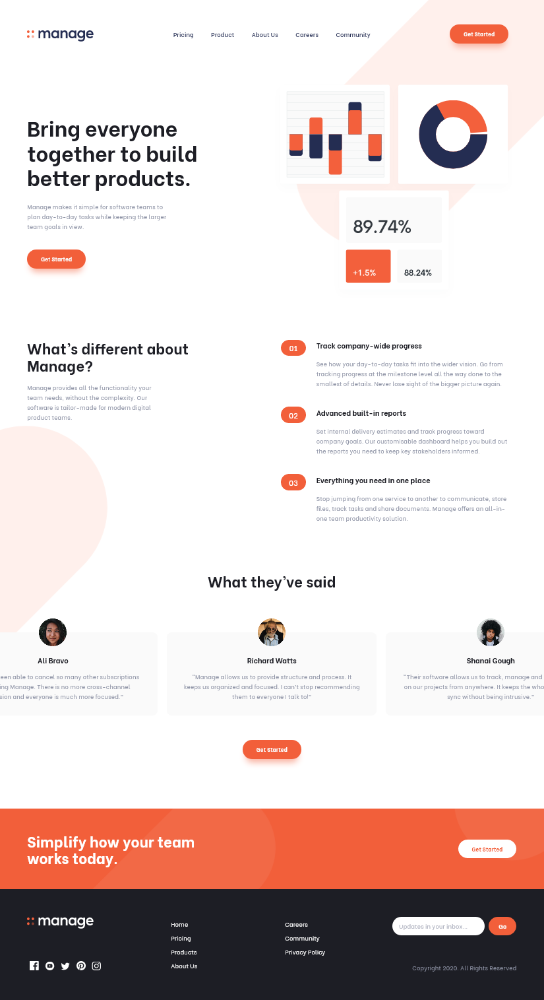
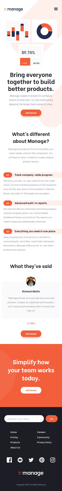

# Frontend Mentor - Manage landing page solution

This is a solution to the [Manage landing page challenge on Frontend Mentor](https://www.frontendmentor.io/challenges/manage-landing-page-SLXqC6P5). Frontend Mentor challenges help you improve your coding skills by building realistic projects. 

## Table of contents

- [Overview](#overview)
  - [The challenge](#the-challenge)
  - [Screenshots](#screenshots)
  - [Links](#links)
- [My process](#my-process)
  - [Built with](#built-with)
  - [What I learned](#what-i-learned)
  - [Continued development](#continued-development)
  - [Useful resources](#useful-resources)
- [Author](#author)

**Note: Delete this note and update the table of contents based on what sections you keep.**

## Overview

### The challenge

Users should be able to:

- View the optimal layout for the site depending on their device's screen size
- See hover states for all interactive elements on the page
- See all testimonials in a horizontal slider
- Receive an error message when the newsletter sign up `form` is submitted if:
  - The `input` field is empty
  - The email address is not formatted correctly

### Screenshots
>
>

### Links

- [Solution URL](https://github.com/Bonrey/Frontend/tree/main/HTML-SASS-JavaScript/Manage%20Landing%20Page)
- [Live site URL](https://manage-landing-page-khaki.vercel.app/)

## My process

### Built with

- Semantic HTML5 markup
- CSS custom properties
- Flexbox
- CSS Grid
- VanillaJS

### What I learned

- How to create a slideshow in JavaScript (probably the most difficult thing)
- How to animate link underlines
- How to darken the background on menu popup
- Using animation along with sound
- Create responsive SVG images
- Using SVG images to create different shapes

### Continued development

Now I am planning on learning React and start applying it in my projects as well. 😃

### Useful resources

- [w3schools](https://www.w3schools.com/)
- [Animating Link Underlines](https://tobiasahlin.com/blog/css-trick-animating-link-underlines/)
- [Darkening the background on popup](https://stackoverflow.com/questions/31054353/darken-the-entire-page-when-opening-and-produce-a-fade-out-effect-when-closing-a)
- Stack Overflow & Google 😁

## Author

- Frontend Mentor - [@Bonrey](https://www.frontendmentor.io/profile/Bonrey)
- All of my projects - [Vercel](https://vercel.com/dashboard/projects)